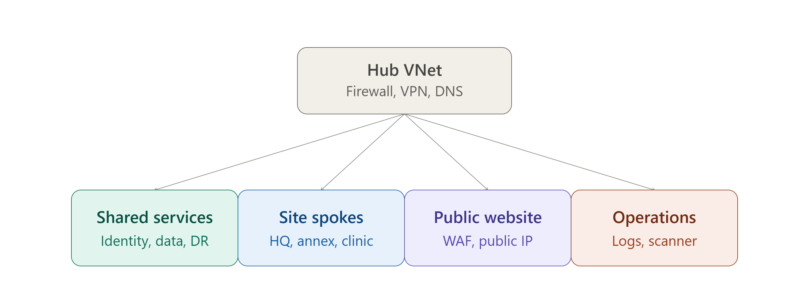
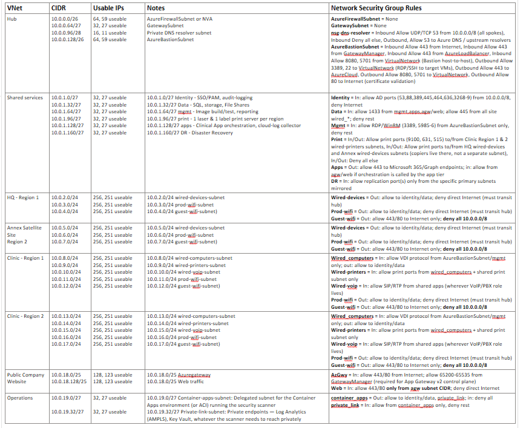

# Terraform-Azure
Terraform Infrastructure Projects for Azure

Day 1:
I deployed my first git push and PR with terraform. I created a resource group and a .gitignore.

Day 2:
I will be creating a mock network architecture of a healthcare clinic company. Here is the network architecture I have so far. I will plan out the entire landing zone before deploying with modular terraform files. It will have a hub and spoke topology. Here is the MOP so far for Day 2. I will update it will the VM's needed for each VNET for Day 3.

